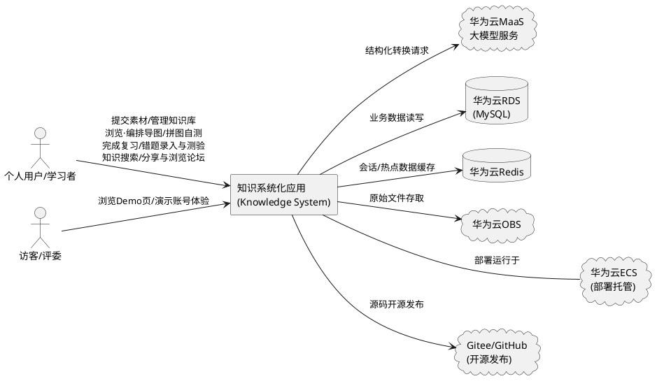
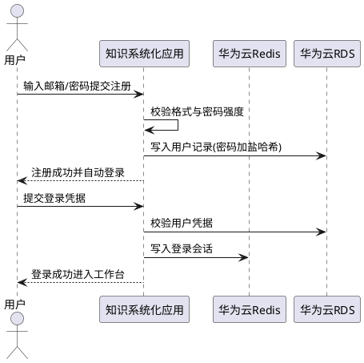
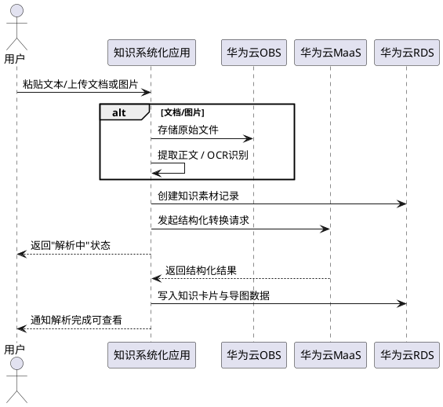
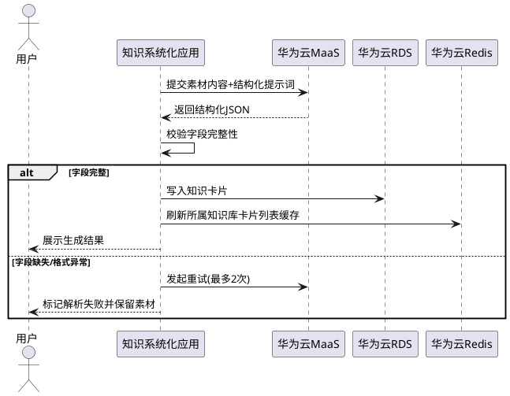
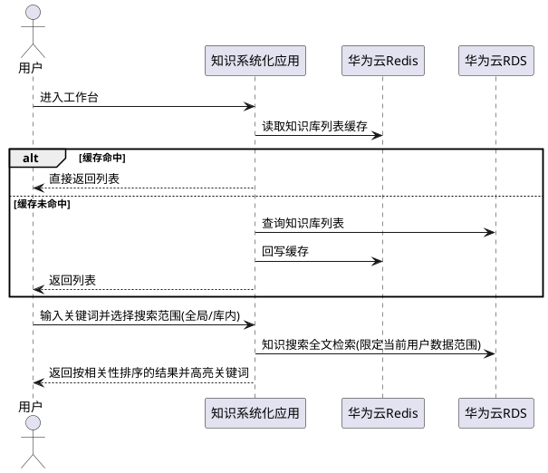
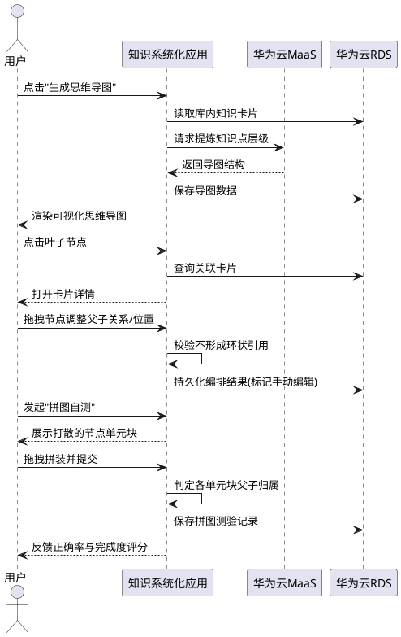
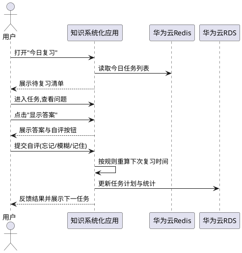
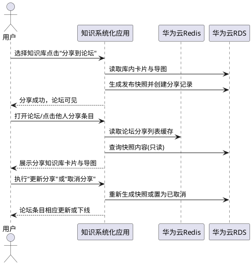
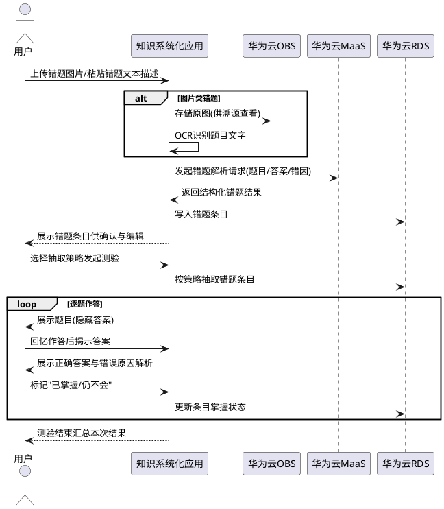

# MemWeave（忆织）需求规格说明书

> 作品全称：MemWeave（忆织）：基于华为云MaaS大模型的多源知识编织与抗遗忘记忆系统
>
> **命名内涵**：Weave（编织）精准对应"多源素材→卡片→导图"的核心动作，Mem 对应抗遗忘记忆；中文"忆织"谐音"一织即成"。

> **📋 文档信息**
>
> **作品名**：MemWeave（忆织）
>
> | 版本 | 日期 | 状态 | 说明 |
> |------|------|------|------|
> | v1.0 | 2026-09-07 | 初稿 | 首次发布 |
> | v1.1 | 2026-09-07 | 评审优化稿 | 修复矛盾项、补齐缺失章节、规范格式 |
> | v1.2 | 2026-09-07 | 合并定稿版 | 合入v1.1评审优化改进项，清除评审批注痕迹，形成基线定稿 |
> | v1.3 | 2026-09-07 | 修订版 | 移除师生角色关系（所有用户均为独立个体，删除原5.7教育者班级场景）；新增5.7知识分享论坛（P1）、"发布快照"分享语义与6.8分享记录实体 |
> | v1.4 | 2026-09-07 | 修订版 | 新增5.8错题本与错题测验（P1，测验题目仅来源于用户录入的错题条目，不含独立AI出题）；5.4.1规则4升级为覆盖卡片/素材/错题条目的知识搜索（全局/库内范围、相关性排序），4.1补充大体量搜索性能指标；5.5新增导图拼图自测与自定义拖拽编排（P1）；新增领域术语与6.9~6.11实体定义 |
> | v1.5 | 2026-09-07 | 修订版 | 优先级收敛：5.7知识分享论坛与5.5导图拼图自测（定义为"固定布局、逐层拼装"简化模式）由P1降为P2，P1聚焦错题本重点做深，第5章补充P1范围控制原则（弹性裁剪机制）；OCR识别路径锁定为华为云MaaS多模态大模型直接识别（3.2节），5.2.1/5.8.1同步更新并新增图片上传前端压缩预处理约束；5.3.1解析状态规则补充异步执行行为约束；6.8快照内容补充导图节点画布位置一致性约束 |
> | v1.6 | 2026-09-07 | 产品定位扩展版 | 产品定位由"教育行业+个人成长"扩展为"个人知识沉淀与人生经验积累"广义定位：1.1核心职责改写为"个人专属的知识/人生经验图库"，明确可沉淀学习知识、读书感悟、生活体悟、错题等多类内容，错题本定位为学习场景之一而非产品全部；1.2核心输入补充读书摘录/人生感悟/生活体悟/金句思想等非学习场景素材示例；3.1角色定义扩展为"沉淀读书感悟与人生体悟，构建独属于自己的知识/人生经验图库"；2.领域术语"知识素材"备注补充多场景来源、"知识库"示例补充读书笔记/人生感悟集、"错题本/错题条目"备注补充学习场景定位说明；5.8能力定位补充"错题本为学习场景沉淀能力之一，与读书感悟、生活体悟等场景并列，并非产品全部定位"；全文"教育行业"等整体定位表述同步扩展为广义个人知识沉淀 |
> | v1.7 | 2026-09-07 | 作品命名定稿版 | 写入参赛作品名"MemWeave（忆织）"：主标题改为作品名、文档头补充作品全称与命名内涵说明、文档信息块新增"作品名"字段、1.1核心职责融入"编织（Weave）多源素材为卡片与导图、记忆（Mem）抗遗忘"命名内涵；2.领域术语新增"人生经验图库（Life Experience Atlas）"作为产品别名术语锚点；评审权重下方补充广义个人知识定位的评审导向说明；1.4职责边界第1条保留"不做教务"边界声明 |
>
> **目录**：1.组件定位 · 2.领域术语 · 3.角色与边界 · 4.DFX约束 · 5.核心能力 · 6.数据约束

> 项目背景：第十一届华为ICT大赛创新赛·赛道一（赛题1：基于华为云产品打造AI创新应用）参赛作品
> 应用领域：个人知识沉淀与人生经验积累（覆盖学习知识、读书感悟、生活体悟、错题复盘等广义个人知识场景）
>
> **评审权重**（本规格以初赛权重为主要设计导向）：
> - 初赛：创新性60% + 应用价值40%；
> - 中国总决赛：创新性40% + 应用价值35% + 完整性与可展示性15% + 答辩表现10%；
> - 全球总决赛：创新性40% + 应用价值30% + 完整性与可展示性15% + 作品应用&落地进展10% + 答辩表现5%。
>
> **评审导向说明**：广义个人知识/人生经验图库定位有助于提升应用价值得分点（覆盖更广泛用户群体与使用场景，商用落地潜力与可复制性更强）。
>
> **赛程约束**：报名截止2026年11月30日；初赛2026年12月；中国总决赛2027年3月；全球总决赛2027年5月（以组委会通知为准）。P0功能须在报名截止前完成开发并可用于初赛材料演示。

## 1. 组件定位

### 1.1 核心职责

> **命名内涵**：MemWeave（忆织）—— Weave（编织）对应"多源素材→卡片→导图"的核心动作，Mem（Memory）对应抗遗忘记忆；中文"忆织"谐音"一织即成"。

本组件（MemWeave/忆织）本质是用户**个人专属的知识/人生经验图库**，负责将用户多源输入的知识素材（文字、文档、图片）通过大模型一键**编织**为结构清晰的知识卡片与思维导图，并借助抗遗忘**记忆**机制实现知识的长期留存与体系化积累。可沉淀的内容覆盖广义个人知识场景，包括但不限于：学习知识（课堂笔记、讲义、课件等）、读书感悟（看书领悟到的人生知识、金句、思想片段）、现实生活体悟（亲身经历总结的人生经验、生活智慧）、错题本（学习场景下的薄弱知识点沉淀，作为众多沉淀场景之一而非产品全部定位）。同时支持将用户上传的错题图片或文本描述一键转化为错题本条目并基于错题本条目开展测验抽取；提供面向大体量数据的全库知识搜索，以及导图拼图自测与自定义拖拽编排能力；并提供站内知识分享论坛，支持用户将自建知识库分享出去供全体用户浏览。系统内每个用户均为独立个体，彼此之间不产生任何用户间关联，服务于个人知识沉淀与人生经验积累的广义个人知识管理场景。

### 1.2 核心输入

1. **用户注册/登录请求**（来源：PC浏览器Web页面）：账号凭据，用于身份识别与数据归属。
2. **多源知识素材**（来源：用户上传）：
   - 纯文本粘贴（学习笔记、课堂摘记、金句摘要、读书摘录、人生感悟、生活体悟、金句思想等广义个人知识内容）；
   - 文档文件（PDF、Word docx、Markdown、TXT，如课件、讲义、论文、读书笔记、人生感悟集等）；
   - 图片文件（JPG、PNG，如板书照片、书页拍照、笔记截图、读书摘录拍照、生活体悟手写拍照等）。
3. **知识组织操作**（来源：用户）：创建/重命名/删除知识库、编辑知识卡片、调整思维导图节点、打标签、知识搜索（见5.4节）。
4. **复习交互指令**（来源：用户）：查看今日复习任务、作答卡片问答、提交掌握度自评。
5. **错题录入素材**（来源：用户上传，定位为学习场景下的薄弱知识点沉淀）：错题图片（JPG/PNG，如做错的题目拍照）或错题文本描述粘贴，一键转化为错题本条目（见5.8节）。
6. **错题测验操作**（来源：用户）：选择抽取策略发起测验、回忆作答、揭示答案与解析、标记"已掌握/仍不会"（见5.8节）。
7. **导图编排与拼图自测操作**（来源：用户）：拖拽节点调整父子关系与位置以自定义编排思维导图、发起导图拼图自测并拖拽拼装单元块（见5.5节）。
8. **论坛分享操作**（来源：用户）：将自建知识库分享至知识分享论坛、更新已分享快照、取消分享（见5.7节）。
9. **论坛浏览请求**（来源：用户）：浏览论坛分享列表，只读查看他人分享的知识库快照（见5.7节）。
10. **结构化解析任务**（来源：系统内部调度）：对已上传素材与错题录入内容触发的大模型转换请求（面向华为云MaaS）。

### 1.3 核心输出

1. **结构化知识卡片**（目标：用户界面）：包含标题、一句话摘要、核心要点列表、自测问答、标签、来源溯源的字段化知识单元。
2. **思维导图**（目标：用户界面）：某知识库/主题下知识点层级关系的可视化树形视图，支持展开浏览、自定义拖拽编排与拼图自测（打散单元块、拼装判定与了解程度评分）。
3. **错题本与错题测验结果**（目标：用户界面）：结构化错题条目列表（题目内容、正确答案、错误原因解析、错因/知识点标签），以及基于错题条目按策略抽取组织的测验过程与"已掌握/仍不会"结果反馈。
4. **知识搜索结果**（目标：用户界面）：跨知识卡片、知识素材与错题条目的搜索结果列表，按相关性排序并高亮命中关键词，支持全局与库内两种范围。
5. **复习任务列表与掌握度统计**（目标：用户界面）：今日待复习清单、累计复习次数、遗忘率趋势等概览数据。
6. **论坛分享内容**（目标：用户界面）：知识分享论坛的分享条目列表，以及他人分享知识库快照的只读浏览视图（知识卡片与思维导图）。
7. **持久化数据写入**（目标：华为云服务）：用户、知识与论坛分享数据（含错题条目、错题测验记录、导图拼图测验记录）写入RDS（MySQL），热点会话与列表数据缓存至Redis，原始文件存入OBS。
8. **大模型结构化转换请求**（目标：华为云MaaS）：携带素材或错题内容的解析Prompt，接收结构化JSON结果。

### 1.4 职责边界

本组件**不负责**以下事项（防止职责蔓延）：

1. **教育课程的教学过程管理**：不提供排课、签到、作业批改、成绩管理等教务功能，仅覆盖"知识素材系统化"环节（学习场景下的教学素材为众多可沉淀素材之一，产品整体覆盖学习知识、读书感悟、生活体悟等广义个人知识场景）。
2. **用户间社交互动与用户关联**：仅提供知识库分享与浏览的论坛版块（见5.7节），不提供评论、点赞、关注、私信等用户间社交互动功能；用户彼此为独立个体，不产生任何用户间关联（已明确不做）。
3. **大模型的训练与微调**：仅调用华为云MaaS上已有的大模型能力，不承担模型训练职责。
4. **通用文件云盘服务**：不提供文件版本管理、离线同步、大文件存储（上限20MB）等网盘能力。
5. **多端适配**：仅支持PC端主流浏览器，不做移动端响应式适配（已明确不做）。
6. **知识内容的版权审核**：用户对上传素材的合法性负责，系统不做内容版权鉴定。
7. **独立AI出题功能**：系统不提供独立的大模型自动生成新题目（AI出题）能力；错题测验的题目必须仅来源于用户本人录入的错题本条目，系统仅执行抽取与测验组织（已明确不做，见5.8节）。

## 2. 领域术语

**人生经验图库（Life Experience Atlas）**
- 定义：产品 MemWeave（忆织）对个人知识/人生经验图库的别称，强调覆盖学习知识、读书感悟、生活体悟、错题等广义个人知识沉淀场景。
- 备注：与"知识系统化应用""MemWeave（忆织）"等价指代本产品；用于答辩与评审中突出广义个人知识沉淀定位，区别于狭义教育行业定位。

**知识素材（Knowledge Asset）**
- 定义：用户通过多源导入方式提交给系统的原始知识内容（文本/文档/图片），及其存储在系统中的文件实体与元数据记录，是知识结构化的源材料。
- 备注：又称"原始素材"；可来源于学习笔记、读书摘录、人生感悟、生活体悟、错题拍照等多类场景；一个知识素材经结构化后可生成一个或多个知识卡片。

**知识卡片（Knowledge Card）**
- 定义：由大模型基于知识素材生成的最小结构化知识单元，包含标题、摘要、核心要点、自测问答与标签字段，是复习、检索和思维导图的基本载体。

**知识库（Knowledge Base）**
- 定义：用户按主题自定义组织的知识卡片与思维导图集合（如"高数上册""Python入门""读书笔记""人生感悟集"等，覆盖学习知识与读书感悟、生活体悟等广义个人知识主题），是系统内知识的第一级管理容器，支持分类与关键词检索。

**知识搜索（Knowledge Search）**
- 定义：面向当前用户全部可检索数据（知识卡片、知识素材、错题条目）的关键词搜索能力，支持"全局搜索"与"库内搜索"两种范围，结果按相关性排序并高亮命中关键词。
- 备注：大体量数据（单用户1万条可检索记录）下的搜索性能约束见4.1节；语义搜索（按语义相近而非字面命中检索）为P2演进项，见5.4.1规则5。

**思维导图（Mind Map）**
- 定义：以树形层级结构呈现某一主题下知识点归属关系的可视化视图，由大模型依据知识卡片内容自动生成，并支持用户节点级编辑。

**导图拼图自测（Map Puzzle Self-test）**
- 定义：将思维导图全部节点按固定布局打散为不显示层级关系的单元块，由用户逐层拖拽拼回其认为正确的层级结构，系统自动判定拼装正确性并反馈对知识大纲整体了解程度的自测方式。
- 备注：又称"拼图自测"；采用"固定布局、逐层拼装"的简化模式，不做自由画布打散；判定依据为拼装结果与原导图父子关系的一致性（见5.5.1规则8~10）。

**自定义拖拽编排（Drag-and-drop Arrangement）**
- 定义：用户通过拖拽自由调整导图节点的父子关系与位置、从头编排自己所理解的思维导图的能力。
- 备注：编排结果持久化保存，导图"版本来源"随之标记为"手动编辑"（与6.4节字段一致，见5.5.1规则5）。

**知识结构化（Structuring）**
- 定义：系统调用华为云MaaS大模型，将非结构化素材内容转换为"标题—摘要—要点—问答—标签"固定字段结构化输出的处理过程。

**间隔复习（Spaced Repetition）**
- 定义：依据遗忘曲线模型，按用户掌握度自评结果动态计算下次复习时间的复习调度机制，用于对抗知识遗忘。
- 备注：MVP阶段采用简化的艾宾浩斯间隔集，具体算法参数属于设计范畴，本文档仅约束其外部行为。

**复习任务（Review Task）**
- 定义：系统为某张知识卡片在特定日期排定的待办复习事项，展示卡片自测问答，并接收用户的掌握度自评。

**掌握度自评（Mastery Rating）**
- 定义：用户完成一次复习任务后，对自己对该知识点记忆状态的主观评级，取值为：忘记 / 模糊 / 记住，是复习间隔重算的输入。

**错题本（Mistake Notebook）**
- 定义：用户个人名下全部错题条目的集合容器，按用户严格隔离，仅限本人录入、查看与测验。
- 备注：当前版本每位用户拥有一个默认错题本，错题条目可选关联知识库或知识卡片；错题本为产品在**学习场景**下的知识沉淀方式之一，产品整体定位为覆盖学习知识、读书感悟、生活体悟、错题复盘等多场景的个人知识/人生经验图库，错题本并非产品全部定位。

**错题条目（Mistake Entry）**
- 定义：用户将做错题目的图片或文本描述一键转化生成的结构化记录，包含题目内容、正确答案、错误原因解析与错因/知识点标签，是错题测验的唯一题目来源。
- 备注：图片类条目可溯源查看原图；掌握状态取值为"未掌握/已掌握"（见5.8节、6.9节）；错题条目为学习场景下的薄弱知识点沉淀方式之一，与读书感悟、生活体悟等场景并列，并非产品全部定位。

**错题测验（Mistake Quiz）**
- 定义：从用户本人错题本中按选定策略（按顺序/随机，可按标签/错因筛选扩展）抽取错题条目，经"回忆作答→揭示答案与解析→标记掌握状态"交互完成的自我测验。
- 备注：系统不提供独立AI出题功能，测验题目必须仅来源于用户录入的错题条目（见5.8.1规则4）。

**多源导入（Multi-source Import）**
- 定义：用户通过粘贴文本、上传文档或上传图片三种方式向系统提交知识素材的能力统称。

**知识分享论坛（Knowledge Sharing Forum）**
- 定义：系统内置的站内论坛版块，向全部登录用户开放，用于展示并只读浏览全体用户分享的知识库发布快照。

**发布快照（Published Snapshot）**
- 定义：用户执行分享时系统生成的知识库只读副本，包含分享时刻的卡片集合与思维导图结构，生成后与原库解耦，不随原库后续编辑自动变更。
- 备注：又称"分享副本"；分享功能启用时即采用"发布快照"语义，原库内容更新须由分享者手动执行"更新分享"同步（见5.7节）。

**大赛演示账号（Demo Account）**
- 定义：为大赛可视化Demo展示预置的体验账号，预置示例知识库与复习数据，供评委与访客快速体验核心流程。

## 3. 角色与边界

### 3.1 核心角色

- **个人用户/学习者**：系统的唯一用户类型，MVP必备。每个用户均为独立个体，彼此之间不产生任何用户间关联（无师生、同班等组织关系）。提交个人多源知识素材（涵盖学习知识、读书感悟、生活体悟等广义个人知识内容），管理个人知识库，浏览并自定义编排思维导图、开展导图拼图自测，完成抗遗忘复习任务，沉淀读书感悟与人生体悟，构建独属于自己的知识/人生经验图库；上传错题图片或文本描述沉淀个人错题本（学习场景下的薄弱知识点沉淀），并基于错题条目开展测验；通过知识搜索检索自有知识数据；并可将自建知识库分享至知识分享论坛、浏览他人分享的知识库（见5.7节）。
- **访客/评委（未注册用户）**：通过产品Demo页浏览功能介绍与交互流程演示；可通过预置演示账号体验完整核心流程（服务大赛可视化展示要求）。

### 3.2 外部系统

- **华为云MaaS（大模型服务）**：下游AI依赖。接收本系统发起的知识结构化、OCR后的文本整理、思维导图生成、错题条目解析（题目/答案/错因提取）请求，返回结构化JSON结果。
- **OCR识别能力**：图片素材文字识别（见5.2节图片导入、5.8节错题图片录入）的核心依赖。识别路径已锁定为**华为云MaaS多模态大模型直接识别**：一次调用同时完成文字识别与结构化输出，无需独立OCR服务，不新增独立OCR资源依赖项（与3.2节MaaS条目为同一依赖）；若决赛阶段识别质量不达预期，可评估引入华为云OCR服务作为备选增强。
- **华为云短信服务（SMS）（P2扩展依赖）**：手机号注册（见5.1.1规则1）所需的验证码发送能力。备注：本条仅服务于P2手机号注册扩展（与任何用户间组织场景无关），在该扩展启用时开通，须列入资源开通清单。
- **华为云RDS（MySQL）**：下游持久化存储。存储用户账户、知识素材元数据、知识卡片、思维导图结构、复习任务等核心业务数据。
- **华为云Redis**：下游缓存服务。缓存登录会话、知识卡片列表、今日复习任务等热点数据，降低RDS读取压力。
- **华为云OBS**：下游对象存储。存储用户上传的文档与图片原始文件，供结构化流程读取。
- **华为云ECS（部署托管）**：应用运行载体。承载Web前端、后端服务与可视化Demo页面的部署运行。
- **Gitee/GitHub**：开源发布渠道。承载项目源码、README与华为云资源开通说明，满足入围决赛开源要求。

### 3.3 交互上下文

> **图表渲染说明**：本文流程图采用PlantUML语法。Gitee可原生渲染PlantUML；GitHub不原生支持，开源仓库（README）中如需直接渲染须转为Mermaid语法或导出为图片，定稿时需处理。

## 4. DFX约束

### 4.1 性能

1. PC浏览器页面首屏加载时间必须不超过3秒（华为云同区域部署环境）。
2. 纯文本素材（不超过5000字符）从提交到知识卡片生成完成必须不超过30秒；文档/图片素材（不超过20MB）必须不超过120秒。
3. 知识卡片列表查询在单知识库1000张卡片规模下必须不超过2秒返回。
4. 知识搜索（见5.4.1规则4）在单用户1万条可检索记录（知识卡片、知识素材与错题条目合计）规模下必须不超过2秒返回结果；检索所采用的具体技术手段（如索引方案选型）属于设计阶段范畴，本需求仅约束上述外部行为。
5. 大赛演示期间不少于50并发用户操作时，系统必须不出现服务崩溃或任务丢失。

### 4.2 可靠性

1. 核心业务数据（用户、素材、卡片、导图、复习任务）必须实现RDS持久化，任何返回成功标志的操作在服务重启后必须可完整恢复。
2. Redis缓存不可用时，系统必须自动降级为直查RDS，整体功能可用性不低于99%（演示周期内。演示周期指自初赛材料提交截止之日起至本届大赛全球总决赛结束之日止，具体起止以组委会通知为准）。
3. 大模型调用失败时必须保留用户原始素材不丢失，并提供重试入口；演示期结构化任务最终成功率必须不低于95%。

### 4.3 安全性

1. 用户密码必须经加盐哈希后存储，禁止明文落库。
2. 不同用户的知识数据必须严格隔离（论坛中"已分享"状态的发布快照为唯一例外，见5.7节），用户A必须无法通过任何接口读取或修改用户B的知识内容。
3. 所有写操作接口必须校验登录态，未认证请求必须被拒绝并返回统一错误提示。
4. 华为云访问凭据（AK/SK、MaaS API Key）必须不出现于开源仓库代码中，必须通过环境变量或配置中心注入。

### 4.4 可维护性

1. 关键操作（素材导入、结构化、复习提交）必须输出结构化日志，至少包含用户标识、操作类型、耗时与结果状态。
2. 开源仓库必须包含完整README，含本地一键运行说明与华为云资源（RDS/Redis/OBS/MaaS）开通配置清单。
3. 业务逻辑必须与华为云SDK调用分层解耦，业务规则不得直接依赖具体SDK实现类。

### 4.5 兼容性

1. 系统必须仅适配PC端主流浏览器（Chrome、Edge最近两个大版本），必须不承诺移动端体验。
2. 界面必须支持最小视口1280×720，主体内容区域采用居中布局并充分利用可用屏幕空间。
3. 文档解析必须支持PDF、Word（docx）、Markdown、TXT四种格式；图片识别必须支持JPG、PNG两种格式。

## 5. 核心能力

> **优先级定义**（对应"简单想法、逐渐扩展"的演进策略）：
> - **P0（MVP核心）**：最小可演示闭环，缺失任一项则大赛Demo不成立；
> - **P1（MVP增强）**：首个迭代补齐，显著提升演示完整度与使用体验；
> - **P2（扩展演进）**：决赛冲分与商业落地扩展项。
> - **范围控制原则**：P1交付顺序以错题本（5.8节）优先做深；若迭代进度受限，知识搜索（5.4.1规则4）、长内容拆分（5.3.1规则6）等增强项可经确认后顺延至P2交付（弹性裁剪机制），P0核心闭环（导入→卡片→导图→复习）不受影响。

### 5.1 用户注册登录与演示体验（P0）

#### 5.1.1 业务规则

1. **账号注册规则**：MVP阶段系统须支持使用邮箱 + 密码注册个人账号；手机号注册为P2扩展能力（依赖短信验证码服务，须列入3.2节外部系统与资源开通清单）。
   a. 验收条件：[用户提交合法邮箱与符合强度要求的密码] → [系统创建账号并自动登录进入工作台]
2. **密码强度规则**：密码长度必须为8~32位，且必须同时包含字母与数字。
   a. 验收条件：[用户提交不符合强度的密码] → [系统拒绝注册并提示具体强度要求]
3. **重复注册规则**：同一邮箱必须禁止重复注册。
   a. 验收条件：[用户使用已注册邮箱再次注册] → [系统提示"该邮箱已注册"并引导登录]
4. **登录态规则**：用户登录成功后，系统必须维持有效登录态（基于Redis会话），有效期不短于24小时。
   a. 验收条件：[用户登录后24小时内再次访问] → [系统保持登录态免二次登录]
5. **演示账号规则**：系统必须预置至少一个演示账号，预置示例知识库（含知识卡片与思维导图）及待复习任务。
   a. 验收条件：[评委使用演示账号登录] → [系统可直接浏览完整示例数据并体验核心流程]
6. **演示账号数据重置规则**：系统必须提供演示账号数据重置机制（每日定时自动重置或运营手动触发），保证评委任意时刻体验时预置数据完整可用。
   a. 验收条件：[演示账号数据被访客修改或删除后执行重置] → [账号数据恢复至初始预置状态]
7. **禁止项**：未登录用户禁止访问任何知识数据接口。
   a. 验收条件：[未认证请求访问知识库接口] → [系统返回401并跳转登录页]

#### 5.1.2 交互流程

#### 5.1.3 异常场景

1. **注册信息校验失败**
   a. 触发条件：邮箱格式错误或密码强度不足。
   b. 系统行为：拦截提交，不写入任何数据。
   c. 用户感知：表单字段级错误提示，指明具体不合规原因。
2. **登录凭据错误**
   a. 触发条件：邮箱不存在或密码不匹配。
   b. 系统行为：返回统一失败结果，不做账号存在性区分（防枚举）。
   c. 用户感知：提示"邮箱或密码错误"。
3. **会话过期**
   a. 触发条件：登录态超过有效期或Redis会话丢失。
   b. 系统行为：清除本地登录态，记录访问目标页。
   c. 用户感知：跳转登录页，登录成功后回到原目标页。

### 5.2 多源知识导入（P0：文本导入 / P1：文档与图片导入）

#### 5.2.1 业务规则

1. **文本导入规则（P0）**：当用户在工作台粘贴文本并提交导入时，系统必须创建一条知识素材记录并立即触发结构化流程。
   a. 验收条件：[用户粘贴不超过5000字符的文本点击导入] → [系统展示"解析中"状态并生成素材记录]
2. **文档导入规则（P1）**：当用户上传PDF/Word/Markdown/TXT文件时，系统必须提取文件正文文本后进入结构化流程。
   a. 验收条件：[用户上传20MB以内的合法文档] → [系统完成提取并生成素材记录，可溯源到原文件]
3. **图片导入规则（P1）**：当用户上传JPG/PNG图片时，系统必须先执行文字识别（OCR，由华为云MaaS多模态大模型直接识别，见3.2节），再进入结构化流程。
   a. 验收条件：[用户上传含清晰文字的板书照片] → [系统识别出文字内容并生成素材记录，素材详情可查看识别文本]
4. **素材归属规则**：导入的素材必须归属于当前登录用户，并在素材详情中保留原始内容。
   a. 验收条件：[任一素材被创建] → [素材详情页可完整查看原始文本/识别文本/原文件预览]
5. **体积与格式限制规则**：文档不超过20MB，图片不超过10MB，文本不超过5000字符；图片必须在提交上传前由前端完成压缩预处理后再提交（压缩处理由前端自动执行，用户无需手动操作，压缩后图片仍须符合上述图片大小上限），以降低上传耗时与识别请求负载。
   a. 验收条件：[用户提交超限或不受支持格式的文件] → [系统在上传前即时提示，不发起解析]
   b. 验收条件：[用户选择图片提交上传] → [前端自动完成压缩预处理后提交，系统接收的图片符合大小上限]
6. **一键转化规则**：单次导入操作从提交到触发结构化必须无需用户进行二次配置（体现"一键转化"核心体验）。
   a. 验收条件：[用户完成任一方式导入] → [无需填写额外表单，系统自动选择默认结构化策略]

#### 5.2.2 交互流程

#### 5.2.3 异常场景

1. **文件超限或格式不支持**
   a. 触发条件：文件大小、类型超出第5.2.1节第5条限制。
   b. 系统行为：前端即时校验拦截，服务端二次校验兜底，不产生素材记录。
   c. 用户感知：区分提示具体超限类型——"文件超出大小限制（文档20MB/图片10MB）"或"格式暂不支持（支持PDF、Word、Markdown、TXT；图片支持JPG、PNG）"。
2. **OCR识别失败或结果为空**
   a. 触发条件：图片模糊、无文字或识别服务异常。
   b. 系统行为：保留图片素材记录，标记识别失败。
   c. 用户感知：提示"未能识别出文字，请上传更清晰的图片或改用文档导入"，素材保留可删除。
3. **文件上传中断**
   a. 触发条件：网络波动导致上传失败。
   b. 系统行为：不产生脏数据记录。
   c. 用户感知：提示上传失败，可重新上传。

### 5.3 知识结构化与卡片生成（P0）

#### 5.3.1 业务规则

1. **结构化生成规则**：当素材进入结构化流程时，系统必须调用华为云MaaS大模型，生成至少包含标题、摘要、核心要点、自测问答、标签五个字段的知识卡片。
   a. 验收条件：[任一素材结构化成功] → [生成一张知识卡片，标题、摘要、核心要点、自测问答四个字段均非空且内容与素材语义一致；标签字段由模型生成、允许为空，用户可后续补充（与6.3节保持一致）]
2. **素材-卡片溯源规则**：每张知识卡片必须保留其来源素材引用，用户可从卡片跳转查看原始内容。
   a. 验收条件：[用户在卡片详情点击"查看来源"] → [系统展示对应素材的原始内容]
3. **卡片编辑规则**：用户必须可对生成的卡片标题、要点、问答与标签进行手动编辑修改。
   a. 验收条件：[用户修改卡片任一字段并保存] → [列表与详情即时呈现修改后内容]
4. **卡片删除规则**：当用户删除知识卡片时，系统必须同时移除其关联的复习任务与导图节点引用。
   a. 验收条件：[用户确认删除某卡片] → [该卡片不再出现在列表、复习任务与思维导图中]
5. **解析状态规则**：素材从提交到出卡必须向用户呈现"解析中 → 已完成 / 解析失败"的可追踪状态；结构化解析必须异步执行，用户提交导入后必须可继续使用其他功能，页面不得因等待解析而阻塞（异步实现机制属于设计阶段范畴，本文仅约束外部行为）。
   a. 验收条件：[用户提交导入后停留页面] → [可见状态流转，完成后无需刷新即可查看卡片]
   b. 验收条件：[用户提交导入后立即切换至其他功能页操作] → [解析于后台持续进行，页面操作不受阻塞，解析完成后该素材状态更新为"已完成"]
6. **长内容拆分规则（P1）**：当素材正文超过单卡片承载长度时，系统必须拆分生成多张卡片并归属于同一素材。
   a. 验收条件：[导入一篇长文讲义] → [生成多张卡片，均可在素材详情下集中查看]

#### 5.3.2 交互流程

#### 5.3.3 异常场景

1. **大模型调用失败**
   a. 触发条件：MaaS服务超时、限流或返回异常。
   b. 系统行为：自动重试最多2次（指数退避），仍失败则任务标记失败并保留素材。
   c. 用户感知：卡片状态显示"解析失败"，提供"一键重试"按钮。
2. **模型返回结构非法**
   a. 触发条件：模型输出不符合约定JSON结构或关键字段为空。
   b. 系统行为：按失败处理并纳入重试，不落库残缺卡片。
   c. 用户感知：与调用失败一致，提示解析失败可重试。
3. **解析结果与素材明显不符**
   a. 触发条件：生成内容为空泛模板、与素材主题无关。
   b. 系统行为：允许用户手动编辑修正，并支持对该素材重新生成。
   c. 用户感知：卡片详情提供"重新生成"入口，覆盖旧卡片前需二次确认。

### 5.4 知识库管理与知识搜索（P0：基础管理 / P1：知识搜索增强）

#### 5.4.1 业务规则

1. **知识库创建规则（P0）**：用户必须可创建、重命名、删除自定义主题知识库。
   a. 验收条件：[用户创建名为"高数上册"的知识库] → [工作台知识库列表出现该库并可进入]
2. **卡片归组规则（P0）**：每张知识卡片必须归属且仅归属一个知识库，用户可移动卡片至其他知识库。
   a. 验收条件：[用户将卡片从库A移动至库B] → [库A列表减少、库B列表增加，移动即时生效]
3. **知识库删除规则**：当用户删除知识库时，系统必须二次确认，并级联删除其下卡片与导图。
   a. 验收条件：[用户确认删除含卡片的库] → [该库及全部下属数据不可再访问]
4. **知识搜索规则（P1）**：系统必须支持对当前用户的全部可检索数据（知识卡片、知识素材、错题条目）执行关键词搜索；搜索范围必须支持"全局搜索"（覆盖全部知识库下属数据与错题本）与"库内搜索"（限定单个知识库及其下属数据）两种；结果必须按相关性排序并高亮命中关键词，且可区分结果类型与所在位置。
   a. 验收条件：[用户在全局搜索输入"梯度下降"] → [2秒内返回涵盖知识卡片、知识素材与错题条目的命中结果，按相关性排序并高亮关键词，可区分类型与所在位置]
   b. 验收条件：[用户在某知识库内执行库内搜索] → [仅返回该库范围（含下属素材及关联至该库的错题条目）内的命中结果]
5. **语义搜索规则（P2演进项）**：系统可基于向量相似度提供语义搜索能力（按语义相近而非字面命中返回结果）；该能力为P2演进项，不纳入MVP与P1交付承诺，P1阶段以关键词搜索为准。
   a. 验收条件：[启用语义搜索后用户搜索与某卡片语义相近但字面不同的表达] → [相关结果出现在返回列表中；P1阶段不做此承诺]
6. **标签筛选规则（P1）**：系统必须支持按标签聚合浏览卡片。
   a. 验收条件：[用户点击标签"机器学习"] → [列表展示该用户全部含此标签的卡片]
7. **数据隔离规则**：所有知识库、卡片与错题条目操作必须限定在当前用户数据范围内；论坛中"已分享"状态的发布快照为唯一允许跨用户可见的数据（见5.7节），其余用户数据仍严格隔离。
   a. 验收条件：[用户A尝试以条目ID直接访问用户B的错题条目] → [系统返回无权限，不泄露内容]

#### 5.4.2 交互流程

#### 5.4.3 异常场景

1. **删除未确认**
   a. 触发条件：用户点击删除含内容的知识库。
   b. 系统行为：弹出确认框，明示将级联删除的卡片数量。
   c. 用户感知：确认后才执行；取消则无任何变更。
2. **检索无结果**
   a. 触发条件：关键词无任何匹配卡片。
   b. 系统行为：返回空结果集。
   c. 用户感知：展示空态页，引导调整关键词或去导入新素材。
3. **缓存击穿**
   a. 触发条件：热点知识库缓存失效瞬间高并发查询。
   b. 系统行为：并发查询合并回源RDS，回写缓存。
   c. 用户感知：无感知，列表正常返回。
4. **搜索关键词为空或纯空格**
   a. 触发条件：用户提交空字符串或纯空格关键词。
   b. 系统行为：前端即时拦截，不发起搜索请求。
   c. 用户感知：提示"请输入搜索关键词"，不展示空结果页造成误导。
5. **搜索超时降级**
   a. 触发条件：搜索请求超过2秒性能上限仍未返回（数据规模激增或检索服务异常）。
   b. 系统行为：按超时处理并终止本次请求，保留重试入口，不阻塞页面其他功能。
   c. 用户感知：提示"搜索超时，请稍后重试或缩小搜索范围"。

### 5.5 思维导图可视化、编排与自测（P0：自动生成与浏览 / P1：节点编辑与拖拽编排 / P2：拼图自测）

#### 5.5.1 业务规则

1. **自动生成规则（P0）**：当知识库内首批卡片生成完毕时，系统必须支持基于卡片内容一键生成该库主题思维导图。
   a. 验收条件：[用户在含卡片的库中点击"生成思维导图"] → [系统生成以知识库为中心、知识点层级展开的树形导图]
2. **层级呈现规则（P0）**：导图必须以层级树呈现知识点归属关系，节点必须支持展开/收起。
   a. 验收条件：[用户浏览导图] → [可逐级展开节点，点击叶子节点可跳转对应知识卡片详情]
3. **节点卡片溯源规则（P0）**：导图中每个叶子知识点必须关联其来源卡片。
   a. 验收条件：[用户点击任意叶子节点] → [系统打开对应卡片，可见完整要点与问答]
4. **节点编辑规则（P1）**：用户必须可对导图执行新增子节点、修改节点标题、删除节点操作。
   a. 验收条件：[用户为某节点新增子节点"易错点"] → [导图即时更新且编辑结果持久保存]
5. **自定义拖拽编排规则（P1）**：用户必须可通过拖拽自由调整节点的父子关系与画布位置，从零或基于既有导图编排自己所理解的思维导图；自由编排结果必须持久化保存，且编排后导图"版本来源"必须标记为"手动编辑"（与6.4节字段一致）。
   a. 验收条件：[用户将节点A拖拽为节点B的子节点] → [导图结构即时更新，刷新后结构保持，版本来源自动标记为"手动编辑"]
   b. 验收条件：[用户拖拽节点调整位置] → [节点位置按用户编排呈现并持久保存]
6. **导图重建规则（P1）**：用户必须可基于库内最新卡片重新生成导图。
   a. 验收条件：[用户确认"重新生成"] → [系统按当前卡片集合重建导图，覆盖前提示旧版（含手动编排结果）将被替换]
7. **导图数据持久化规则**：导图结构与手动编辑（含拖拽编排）结果必须持久保存。
   a. 验收条件：[用户编辑导图后退出并重新进入] → [导图呈现与退出前完全一致]
8. **导图拼图自测规则（P2）**：系统必须支持将当前导图的全部节点按固定布局打散为互不显示层级关系的单元块（不做自由画布打散），用户通过逐层拖拽将单元块拼回其认为正确的层级结构，以自测对知识大纲整体的了解程度。
   a. 验收条件：[用户对某导图发起"拼图自测"] → [系统按固定布局展示打散后的全部节点单元块，原导图层级关系不可见]
9. **拼图判定规则（P2）**：拼装提交后，系统必须自动判定每个单元块的父子归属是否与原导图一致，并以正确率与完成度（正确拼装节点数/总节点数）反馈用户对知识大纲整体的了解程度。
   a. 验收条件：[用户完成拼装并提交] → [系统展示各单元块拼装对错反馈与整体正确率/完成度评分]
10. **拼图结果记录规则（P2）**：每次拼图自测的记录（时间、正确率、完成度）必须留存为导图拼图测验记录（见6.11节）；P2阶段拼图结果默认不写入5.6节复习统计，仅作为独立的大纲自测记录展示，与复习统计的联动计列为后续演进项。
    a. 验收条件：[任一次拼图自测完成] → [系统留存本次测验记录，复习统计数据不发生变化]

#### 5.5.2 交互流程

#### 5.5.3 异常场景

1. **导图生成失败**
   a. 触发条件：大模型服务异常或库内卡片数据不足。
   b. 系统行为：失败时保留旧导图（如有），标记生成失败。
   c. 用户感知：提示生成失败可重试；卡片不足时提示"先导入更多素材"。
2. **导图为空**
   a. 触发条件：知识库内无任何卡片时请求生成导图。
   b. 系统行为：前置校验拦截。
   c. 用户感知：提示"该知识库暂无知识卡片，请先导入素材"。
3. **节点删除导致孤儿子树**
   a. 触发条件：用户删除含子节点的中间节点。
   b. 系统行为：弹窗让用户选择"连同子树删除"或"仅删除该节点（子节点上移一级）"。
   c. 用户感知：操作结果与选择一致，无数据静默丢失。
4. **拖拽形成非法结构**
   a. 触发条件：拖拽编排操作将使导图出现环状引用（如将祖先节点拖为其后代节点的子节点）。
   b. 系统行为：拦截该次拖拽，导图维持拖拽前结构（与6.4节禁止环状引用约束一致）。
   c. 用户感知：提示"该操作会形成循环层级，已被取消"。
5. **拼图自测中途退出**
   a. 触发条件：用户在拼装过程中关闭页面、刷新或切换至其他功能页。
   b. 系统行为：不保存半途拼装结果，不产生拼图测验记录；再次发起时按固定布局重新打散全部节点。
   c. 用户感知：退出无数据损坏；重新发起自测时获得按固定布局重新打散的单元块。

### 5.6 抗遗忘复习（P0：任务与自评 / P1：统计洞察）

#### 5.6.1 业务规则

1. **复习任务排定规则（P0）**：当知识卡片生成完毕时，系统必须按遗忘曲线间隔集为该卡片排定首次复习任务。
   a. 验收条件：[任一卡片创建成功] → [今日或次日复习列表出现该卡片的复习任务]
2. **间隔重算规则（P0）**：当用户提交掌握度自评时，系统必须按"记住→间隔延长、模糊→间隔保持、忘记→间隔重置"的规则重算下次复习时间。
   a. 验收条件：[用户对某卡片连续两次自评"记住"] → [下次复习间隔显著长于首次]
   b. 验收条件：[用户自评"忘记"] → [该卡片次日重新进入复习列表]
3. **今日复习视图规则（P0）**：系统必须为用户提供"今日待复习"清单，展示待复习数量与内容入口。
   a. 验收条件：[存在当日到期任务时用户打开复习页] → [按到期顺序展示任务清单，含卡片问答自测]
4. **复习自测规则（P0）**：复习时系统必须先展示问题引导回忆，用户主动揭示答案后再提交自评。
   a. 验收条件：[用户进入一次复习] → [先见问题，点击"显示答案"后可见答案与自评按钮]
5. **逾期任务规则（P1）**：逾期未完成的复习任务必须自动顺延至最近可复习日期，不得静默丢弃。
   a. 验收条件：[用户连续3天未复习] → [任务累积展示，提示逾期数量]
6. **掌握度统计规则（P1）**：系统必须展示累计复习次数、已掌握/待巩固卡片数与遗忘趋势概览。
   a. 验收条件：[用户完成至少一次复习后查看统计] → [统计页展示与实际操作一致的数据]
7. **复习完成激励规则（P2）**：当用户完成当日全部复习任务时，系统必须给予正向反馈（如连续打卡天数+1）。
   a. 验收条件：[用户清空今日任务] → [呈现完成庆祝反馈，打卡记录更新]

#### 5.6.2 交互流程

#### 5.6.3 异常场景

1. **当日无复习任务**
   a. 触发条件：用户打开复习页但无到期任务。
   b. 系统行为：返回空态及最近一次复习安排。
   c. 用户感知：展示"今日无需复习"，提示下一次复习日期。
2. **自评提交失败**
   a. 触发条件：网络异常导致自评请求失败。
   b. 系统行为：本地暂存自评结果并自动重试提交。
   c. 用户感知：短暂提示"网络波动，已自动重试"，任务状态最终一致。
3. **复习任务悬空**
   a. 触发条件：卡片在复习任务到期前被删除。
   b. 系统行为：级联清理该卡片的全部复习任务。
   c. 用户感知：复习列表中不再出现该卡片任务。

### 5.7 知识分享论坛（P2，决赛冲分扩展项）

> **能力定位**：站内知识分享版块，用户可将自建知识库分享至论坛，供全体用户只读浏览，增强演示完整性与"应用价值"得分点。核心闭环（导入→卡片→导图→复习）仍为P0不动；论坛整体为P2（决赛冲分扩展项），不阻塞MVP与P1交付，于决赛前迭代补齐。

#### 5.7.1 业务规则

1. **分享发布规则（P2）**：用户必须可将其名下含知识卡片的知识库分享至知识分享论坛；分享时系统必须生成该知识库的"发布快照"（含知识库名称、全部知识卡片与思维导图的只读副本）。
   a. 验收条件：[用户选择某含卡片的知识库点击"分享到论坛"] → [论坛出现该知识库的分享条目，内容为分享时刻的快照]
2. **发布快照语义规则（P2）**：分享行为必须以"发布快照"语义生效——分享完成后，原库的后续编辑（新增/修改/删除卡片、调整导图）必须不自动同步至已分享内容。
   a. 验收条件：[用户分享知识库后修改原库任一卡片] → [论坛中该分享条目仍展示分享时刻的旧内容]
3. **手动更新分享规则（P2）**：用户必须可对其已分享的知识库执行"更新分享"，将原库当前内容重新生成快照并覆盖论坛中的旧快照。
   a. 验收条件：[用户对已分享库点击"更新分享"并确认] → [论坛条目内容更新为最新快照，快照更新时间刷新]
4. **取消分享规则（P2）**：用户必须可随时取消分享；取消后该分享条目必须立即从论坛对全体用户不可见，且不影响其原知识库数据。
   a. 验收条件：[用户取消分享后任一用户刷新论坛] → [该条目不再出现，分享者原库数据无任何变化]
5. **论坛浏览规则（P2）**：论坛必须向所有登录用户开放，展示全部"已分享"状态的条目（含快照标题、分享者、分享时间、卡片数量概要），支持只读浏览快照内的知识卡片与思维导图。
   a. 验收条件：[任一登录用户打开论坛并点击他人分享的知识库] → [可浏览快照内的卡片列表与思维导图，页面不出现任何编辑入口]
6. **浏览只读规则（P2）**：浏览者必须不可对他人分享的快照执行编辑、删除等任何写操作；"克隆至个人空间"能力不做承诺（列入后续演进评估）。
   a. 验收条件：[浏览者查看他人分享知识库详情] → [仅提供浏览能力，编辑/删除/克隆等操作入口全部不可用]
7. **数据隔离例外规则**：论坛中"已分享"状态的发布快照必须是唯一允许跨用户可见的数据；分享者原库与其余全部用户数据仍严格执行数据隔离（与4.3节第2条、5.4.1规则7一致）。
   a. 验收条件：[用户B浏览用户A的分享条目] → [仅可见快照内容与展示信息，用户A原库及其余数据不可访问]
8. **禁止项**：禁止在论坛提供评论、点赞、关注、私信等任何用户间社交互动功能；用户间不产生任何关联关系（与1.4节第2条一致）。
   a. 验收条件：[用户浏览论坛与他人分享条目] → [界面不出现评论/点赞/关注/私信等社交互动入口]

#### 5.7.2 交互流程

#### 5.7.3 异常场景

1. **取消分享后论坛可见性变化**
   a. 触发条件：分享者取消分享时，其他用户正浏览论坛或该条目详情。
   b. 系统行为：分享记录置为"已取消"，论坛列表缓存同步失效，条目即时下线。
   c. 用户感知：浏览者刷新后条目消失；停留详情页再操作时提示"该分享已取消"。
2. **原库删除时已分享内容处理**
   a. 触发条件：用户删除已存在论坛分享记录的知识库。
   b. 系统行为：删除确认弹窗中明示该库存在论坛分享，由用户选择"同时移除分享"或"保留论坛快照"；选择保留时快照独立于原库继续展示（见6.6节删除行为）。
   c. 用户感知：按所选行为执行；选择保留后论坛内容不受原库删除影响。
3. **分享内容更新覆盖确认**
   a. 触发条件：用户对已分享库执行"更新分享"，新快照将覆盖论坛旧快照。
   b. 系统行为：二次确认弹窗，明示旧快照将被最新内容替换。
   c. 用户感知：确认后论坛内容更新；取消则维持旧快照不变。
4. **空知识库分享拦截**
   a. 触发条件：用户对不含任何知识卡片的知识库发起分享。
   b. 系统行为：前置校验拦截，不创建空快照分享记录。
   c. 用户感知：提示"该知识库暂无知识卡片，暂无法分享，请先导入素材"。
5. **重复分享同一知识库**
   a. 触发条件：用户对已在论坛分享的知识库再次发起分享。
   b. 系统行为：幂等处理，同一知识库同一时间最多一条有效分享记录，引导使用"更新分享"。
   c. 用户感知：提示"该知识库已在论坛分享，可使用更新分享同步最新内容"。

### 5.8 错题本与错题测验（P1）

> **能力定位**：用户将做错的题目（拍照图片或文本描述）一键转化为结构化错题条目，沉淀为个人错题本；测验题目仅来源于错题本条目，通过"展示题目→回忆作答→揭示答案与解析→标记掌握状态"的交互强化薄弱知识点。系统不提供任何独立AI出题功能（与1.4节第7条一致）。错题本为产品在**学习场景**下的知识沉淀能力之一，与读书感悟、生活体悟等场景并列，并非产品全部定位（产品整体定位为覆盖多场景的个人知识/人生经验图库，见1.1节）。错题本整体为P1能力（首个迭代补齐），不阻塞MVP闭环交付，且为P1阶段重点做深项（场景痛点最真实、与复习叙事最连贯），P1交付顺序以此优先。

#### 5.8.1 业务规则

1. **错题一键录入规则（P1）**：用户必须可通过上传错题图片（JPG/PNG，不超过10MB，提交上传前经前端压缩预处理，与5.2.1体积与格式限制规则一致）或粘贴错题文本描述（不超过5000字符）两种方式一键生成错题条目；图片必须先经文字识别（OCR，由华为云MaaS多模态大模型直接识别，见3.2节）后与文本描述一样进入大模型解析流程（华为云MaaS），提取结构化错题信息，全程无需用户二次配置（复用"一键转化"体验，与5.2.1规则6一致）。
   a. 验收条件：[用户上传一张做错题目的清晰照片并确认] → [系统识别并生成含题目内容、正确答案、错误原因解析的错题条目，全程无需填写额外表单]
2. **错题条目结构规则（P1）**：每条错题条目必须至少包含题目内容、正确答案、错误原因解析三个核心字段，并尽可能生成错因标签与知识点标签（模型未能提取时允许为空，用户可手动补充）；条目必须可选关联当前用户名下的一个知识库或一张知识卡片；图片类错题必须可溯源查看原图。
   a. 验收条件：[任一错题条目生成] → [详情页可查看题目内容、正确答案、错误原因解析与错因/知识点标签，可编辑关联知识库或卡片]
   b. 验收条件：[用户查看图片类错题条目] → [可查看录入时的原图]
3. **错题编辑与删除规则（P1）**：用户必须可手动编辑错题条目的任一字段（含标签与关联关系），并可删除错题条目；删除前系统必须二次确认。
   a. 验收条件：[用户修改某错题的错误原因解析并保存] → [详情即时呈现修改后内容]
   b. 验收条件：[用户删除错题条目并确认] → [该条目不再出现在错题本与任何测验抽取范围内]
4. **禁止AI出题规则（禁止项）**：系统必须不提供独立的大模型自动生成新题目（AI出题）功能；错题测验的题目必须仅来源于用户本人已录入的错题本条目，系统仅执行抽取与测验组织。
   a. 验收条件：[用户完成任一次错题测验] → [测验中出现的每道题均可在其错题本中找到对应条目，不存在系统自行生成的新题目]
5. **测验抽取策略规则（P1）**：发起测验时，系统必须至少支持"按顺序抽取"（按条目录入时间顺序）与"随机抽取"两种策略，并支持限定抽取范围与数量；按标签/错因筛选抽取为后续扩展方向（P2演进项）。
   a. 验收条件：[用户选择"按顺序抽取10条"发起测验] → [测验按录入时间顺序依序出题，共10条]
   b. 验收条件：[用户选择"随机抽取10条"] → [每次发起的题目组合随机产生且全部位于所选范围内]
6. **测验交互规则（P1）**：错题测验必须遵循"展示题目 → 用户回忆作答 → 揭示正确答案与错误原因解析 → 用户标记'已掌握/仍不会'"的交互顺序，标记结果必须即时更新对应错题条目的掌握状态。
   a. 验收条件：[用户进入一道测验题] → [先仅见题目，主动揭示后才见答案与解析，标记后该条目掌握状态即时更新（与6.9节字段一致）]
7. **掌握状态与抽取范围规则（P1）**：错题条目掌握状态取值为"未掌握 / 已掌握"；默认抽取范围仅为"未掌握"条目，用户可选择将"已掌握"条目重新纳入抽取范围；标记"已掌握"的条目必须保留在错题本中，支持随时查看与手动重置为"未掌握"，禁止静默删除。
   a. 验收条件：[用户将某条目标记"已掌握"后按默认范围再次发起测验] → [该条目不出现在抽取范围内且仍可在错题本中查看]
   b. 验收条件：[用户将某"已掌握"条目重置为"未掌握"] → [该条目重新进入默认抽取范围]

#### 5.8.2 交互流程

#### 5.8.3 异常场景

1. **错题图片识别失败**
   a. 触发条件：错题图片模糊、无文字或识别服务异常，OCR无法提取可用题目内容。
   b. 系统行为：保留原图引用，不生成残缺条目。
   c. 用户感知：提示"未能识别出题目内容，请上传更清晰的图片或改用文本描述录入"，原图不丢失。
2. **错题解析结果异常**
   a. 触发条件：大模型解析失败或关键字段（题目内容/正确答案）缺失。
   b. 系统行为：按解析失败处理并提供重试，不落库残缺条目（与5.3.3异常场景1处理原则一致）。
   c. 用户感知：提示解析失败可重试，或改用文本描述录入。
3. **错题本为空时发起测验**
   a. 触发条件：用户错题本内无任何条目，或所选抽取范围内无可用条目（如默认范围下无"未掌握"条目）时发起测验。
   b. 系统行为：前置校验拦截，不启动测验。
   c. 用户感知：无条目时提示"错题本暂无条目，请先录入错题"；范围内为空时提示可调整抽取范围或重置掌握状态。
4. **测验中断恢复**
   a. 触发条件：测验进行中用户关闭页面、网络中断或会话过期。
   b. 系统行为：留存测验进度记录（见6.10节，含题目序列与已提交的逐题标记），已提交的掌握状态更新保持有效。
   c. 用户感知：再次进入时提示继续或放弃——继续则从断点题目作答；放弃则测验记录置为"已放弃"，已更新的掌握状态不回滚。

## 6. 数据约束

### 6.1 用户（User）

1. **用户标识**：系统内唯一，注册时自动生成，全生命周期不变。
2. **邮箱/手机号**：MVP阶段邮箱必填且全局唯一，须符合邮箱格式规范；手机号为P2扩展字段，启用时须保证全局唯一并符合手机号格式规范。
3. **密码**：必填，8~32位且同时含字母与数字，仅以加盐哈希形式存储。
4. **注册时间**：系统记录，用户不可修改。

> 所有用户均为独立个体，系统不设"角色类型"字段（v1.3起移除学习者/教育者二值区分），用户之间不建立任何关联关系（与3.1节、5.7节论坛交互边界一致）。

### 6.2 知识素材（Knowledge Asset）

1. **素材标识**：系统内唯一，创建时自动生成。
2. **归属用户**：必填，必须指向存在的用户，决定数据可见范围。
3. **素材类型**：必填，取值为"文本 / 文档 / 图片"三者之一。
4. **原始内容**：必填，文本保存原文，文档/图片保存OBS文件引用且文件大小不超过20MB（文档）/10MB（图片）。
5. **提取文本**：文档与图片类型素材必填（OCR或正文提取结果），文本类型与原始内容一致。
6. **解析状态**：取值为"解析中 / 已完成 / 解析失败"，创建时初始为"解析中"。
7. **创建时间**：系统记录，用户不可修改。

### 6.3 知识卡片（Knowledge Card）

1. **卡片标识**：系统内唯一，生成时自动创建。
2. **标题**：必填，不超过100字符，非空。
3. **摘要**：必填，不超过300字符，为一句话概括。
4. **核心要点**：必填，为3~10条要点列表，每条不超过200字符。
5. **自测问答**：必填，至少包含1组问答对，用于复习自测。
6. **标签**：可选，不超过10个，每个标签不超过20字符。
7. **来源素材**：必填，必须指向存在的知识素材，用于溯源。
8. **归属知识库**：必填，必须指向当前用户名下的知识库，且仅归属一个知识库。
9. **复习间隔状态**：由复习自评驱动更新，用户不可直接编辑。

### 6.4 思维导图（Mind Map / 导图节点）

1. **导图标识**：系统内唯一，归属且仅归属一个知识库。
2. **根节点**：每个导图必须有且仅有一个根节点，与知识库主题对应。
3. **节点标题**：必填，不超过50字符。
4. **父子关系**：除根节点外每个节点必须且仅有一个父节点，禁止环状引用。
5. **关联卡片**：叶子节点可选关联一张当前知识库内的知识卡片；非叶子节点必须不直接关联卡片。
6. **版本来源**：记录导图为"自动生成"或"手动编辑"；用户执行节点编辑或自定义拖拽编排后必须更新为"手动编辑"，重新生成前必须经用户确认（与5.5.1规则5、规则6一致）。
7. **节点位置**：可选，记录自定义拖拽编排后的节点画布位置信息；未执行过拖拽编排的导图由系统默认布局呈现。
8. **结构合法性**：任何编辑与拖拽编排操作后的导图结构必须持续满足本节第2、4条约束，系统必须拦截产生环状引用的编排操作（与5.5.3异常场景4一致）。

### 6.5 复习任务（Review Task）

1. **任务标识**：系统内唯一，排定时自动生成。
2. **关联卡片**：必填，必须指向存在的知识卡片；卡片删除时任务必须级联清除。
3. **计划复习日期**：必填，由间隔复习规则计算得出，必须不早于卡片创建日期。
4. **任务状态**：取值为"待复习 / 已完成 / 已顺延"，逾期任务必须转为"已顺延"而非删除。
5. **掌握度自评**：任务完成后必填，取值为"忘记 / 模糊 / 记住"三者之一。
6. **完成时间与次数**：系统记录累计复习次数与最近复习时间，用户不可直接修改。

### 6.6 知识库（Knowledge Base）

> 本实体为5.4节知识库管理（P0功能）及5.4.1规则3级联删除行为的数据依据。

1. **知识库标识**：系统内唯一，创建时自动生成。
2. **知识库名称**：必填，不超过50字符，同一用户名下不允许重名。
3. **归属用户**：必填，必须指向存在的用户；知识库及其下全部数据严格归属单一用户（与4.3节第2条数据隔离对齐）。
4. **卡片容量**：单库知识卡片数量不超过1000张（与4.1节第3条性能指标对齐）。
5. **删除行为**：删除知识库必须经用户二次确认，并级联删除其下全部知识卡片、思维导图与复习任务（与5.4.1规则3一致）；若该库存在论坛分享记录，须按5.7.3异常场景2由用户选择"同时移除分享"或"保留论坛快照"。
6. **创建时间**：系统记录，用户不可修改。

### 6.7 复习统计（Review Statistics）

> 本实体（P1）为5.6.1规则6（掌握度统计）与规则7（复习完成激励）的数据依据。

1. **统计数据性质**：由复习任务完成记录聚合派生，系统计算，用户不可直接编辑。
2. **统计范围**：至少包含累计复习次数、已掌握/待巩固卡片数（按最近一次自评"记住/模糊"归类）、按日/周的遗忘趋势；P2阶段增加连续打卡天数记录。

### 6.8 分享记录（Shared Knowledge Base / Forum Share）

> 本实体（P2）为5.7节知识分享论坛的数据依据。

1. **分享标识**：系统内唯一，创建分享时自动生成。
2. **归属用户**：必填，必须指向存在的用户（分享者）；"更新分享""取消分享"操作仅分享者本人可执行。
3. **来源知识库引用**：必填，必须指向分享者名下的知识库；原库删除时不自动级联删除分享记录，按5.7.3异常场景2处理。
4. **快照标题**：必填，不超过50字符，默认取分享时刻的原库名称，论坛展示用。
5. **快照内容**：必填，分享时刻生成的知识库只读副本（含知识卡片集合与思维导图结构）；快照必须完整包含思维导图节点及其画布位置信息（未执行自定义编排的导图为系统默认布局），确保浏览端渲染布局与分享时刻一致；生成后与原库解耦，不随原库编辑自动变更。
6. **分享状态**：取值为"已分享 / 已取消"；仅"已分享"状态的记录在论坛展示，"已取消"记录不在论坛出现，仅作分享者历史管理与系统留存。
7. **分享时间**：系统记录，首次分享时生成，用户不可修改。
8. **快照更新时间**：系统记录，最近一次"更新分享"的时间；未执行过更新时与分享时间一致。

### 6.9 错题条目（Mistake Entry）

> 本实体（P1）为5.8节错题本与错题测验的数据依据。

1. **错题标识**：系统内唯一，录入时自动生成。
2. **归属用户**：必填，必须指向存在的用户；错题数据严格归属单一用户，与其他用户完全隔离（与4.3节第2条、5.4.1规则7一致）。
3. **题目内容**：必填，不超过2000字符，非空。
4. **正确答案**：必填，不超过2000字符，非空。
5. **错误原因解析**：必填，不超过2000字符，非空。
6. **错因/知识点标签**：可选，合计不超过10个，每个不超过20字符（与6.3节标签约束对齐）。
7. **录入来源**：取值为"图片 / 文本"二者之一，创建后不可变更。
8. **来源原图引用**：录入来源为"图片"时必填，指向OBS中该错题原图，供条目详情溯源查看；该原图不属于6.2知识素材实体，独立存储且仅服务错题溯源。
9. **关联知识库/卡片**：可选，至多关联当前用户名下一个知识库或一张知识卡片，仅可作为关联引用，不改变卡片/知识库原有归属关系。
10. **掌握状态**：取值为"未掌握 / 已掌握"，初始为"未掌握"，仅由错题测验中用户标记更新（与5.8.1规则6、规则7一致）。
11. **创建时间**：系统记录，用户不可修改；"按顺序抽取"即依此时间排序。

### 6.10 错题测验记录（Mistake Quiz Record）

> 本实体（P1）为5.8.1规则5~7及5.8.3异常场景4（测验中断恢复）的数据依据。

1. **测验记录标识**：系统内唯一，发起测验时自动生成。
2. **归属用户**：必填，必须指向存在的用户。
3. **抽取策略**：必填，取值为"按顺序 / 随机"二者之一，并记录抽取范围条件（如仅"未掌握"）与抽取数量。
4. **题目序列**：必填，由本次抽取的错题条目标识有序组成，必须全部来自当前用户错题本（禁止项见5.8.1规则4）。
5. **测验进度**：取值为"进行中 / 已完成 / 已放弃"；"进行中"记录用于中断恢复（见5.8.3异常场景4）。
6. **逐题标记结果**：测验完成或中断时留存每道题的用户标记（"已掌握/仍不会"），与对应条目掌握状态更新保持一致。
7. **发起与结束时间**：系统记录，用户不可修改。

### 6.11 导图拼图测验记录（Map Puzzle Record）

> 本实体（P2）为5.5.1规则8~10（导图拼图自测）的数据依据。

1. **拼图记录标识**：系统内唯一，发起自测时自动生成。
2. **归属用户**：必填，必须指向存在的用户。
3. **关联导图**：必填，必须指向该用户名下知识库的思维导图。
4. **打散快照**：必填，发起自测时基于当次导图结构按固定布局生成的打散单元块记录；再次发起时重新生成（与5.5.3异常场景5一致）。
5. **拼装结果**：必填（仅"已完成"记录），包含正确拼装节点数与总节点数（正确率/完成度评分依据）；中途退出不产生结果记录。
6. **完成时间**：系统记录，用户不可修改。
7. **统计归属**：P2阶段仅作为独立的大纲自测记录展示，不写入6.7复习统计；与复习统计的联动计列为后续演进项（与5.5.1规则10一致）。
